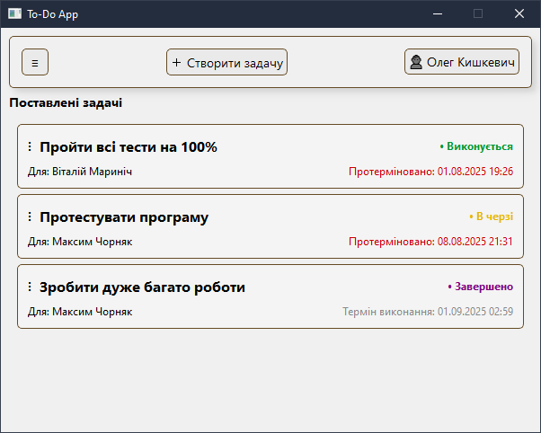
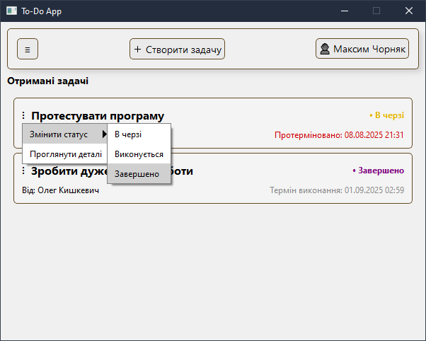

# ToDoApp

**ToDoApp** — це клієнтський додаток для керування задачами в команді. Дозволяє ставити та отримувати задачі між користувачами, відслідковувати статус, терміни виконання та відповідальних осіб.  

## Мета проєкту
Створити кросплатформений застосунок (Qt + C++), який підключається до централізованої бази даних MySQL та дозволяє користувачам ефективно організовувати робочий процес.

## Можливості
- Авторизація користувачів
- Перегляд **поставлених** та **отриманих** задач
- Додавання нових задач
- Анімоване бокове меню
- Автоматичне оновлення списку задач
- Зручний інтерфейс на основі Qt Widgets

## Скріншоти
  

